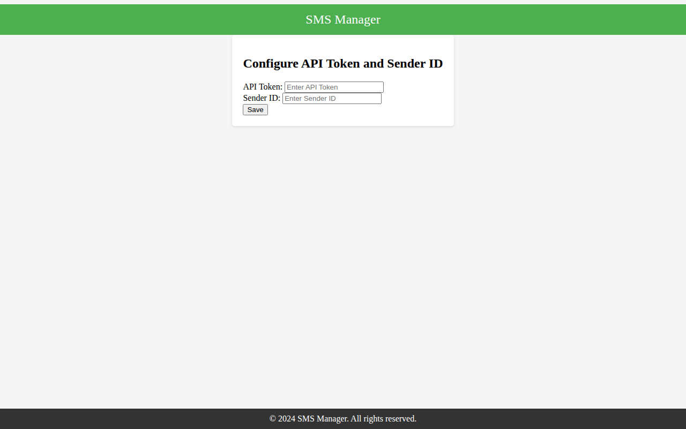

# SMS Frontend Copilot

## Setup Instructions
1. Clone the repository:
   ```bash
   git clone https://github.com/masterlog80/sms-frontend-copilot.git
   cd sms-frontend-copilot
   ```

2. Create the image:
   ```bash
   docker-compose up --build
   ```

## Usage Guide
1. Open your web browser and navigate to `http://localhost:5001` to see the application running.
2. You can access various features from the navigation bar.
3. Make sure to review the documentation for detailed information on each feature.

If you encounter any issues, please refer to the [issues page](https://github.com/masterlog80/sms-frontend-copilot/issues) for troubleshooting tips and solutions.

## Screenshots

### SMS Manager


### Authentication Page


