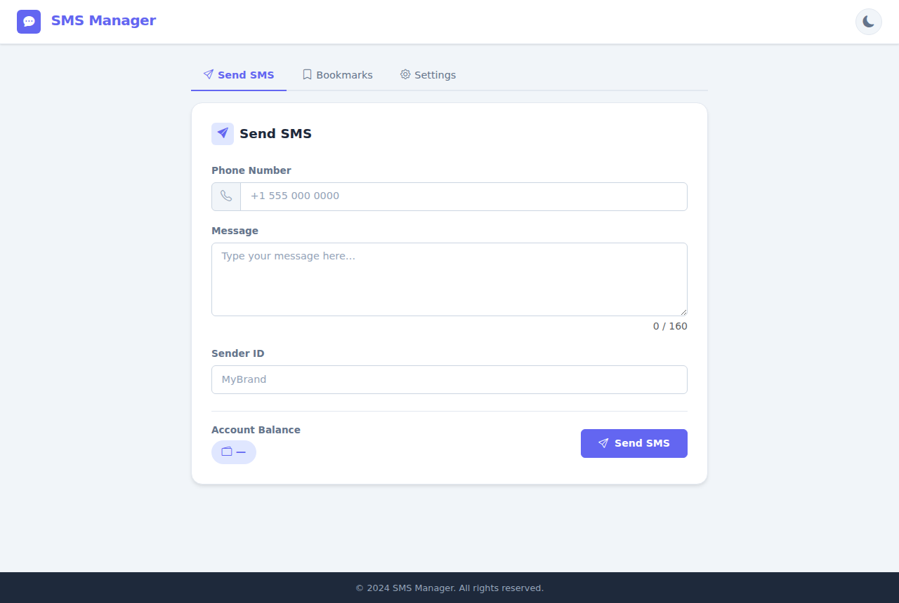
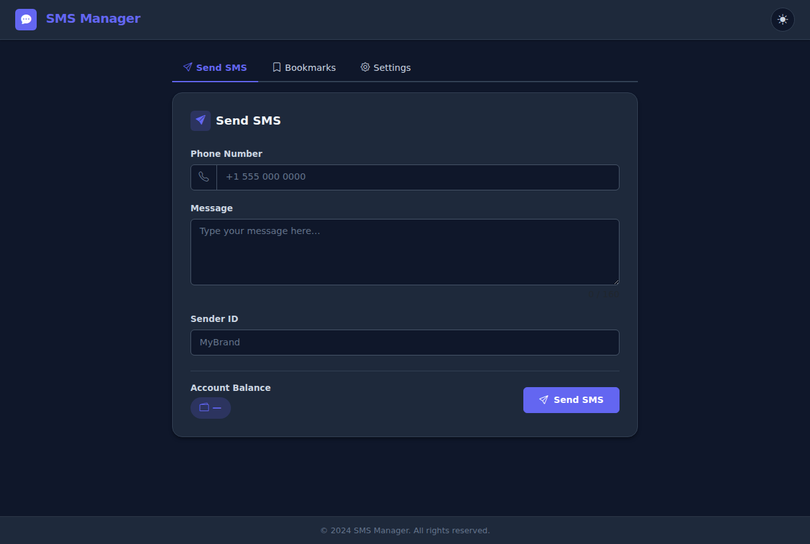
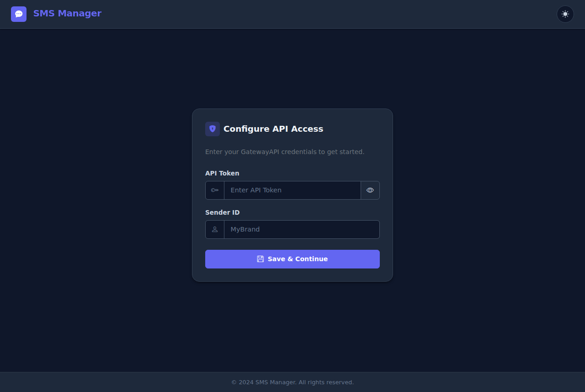
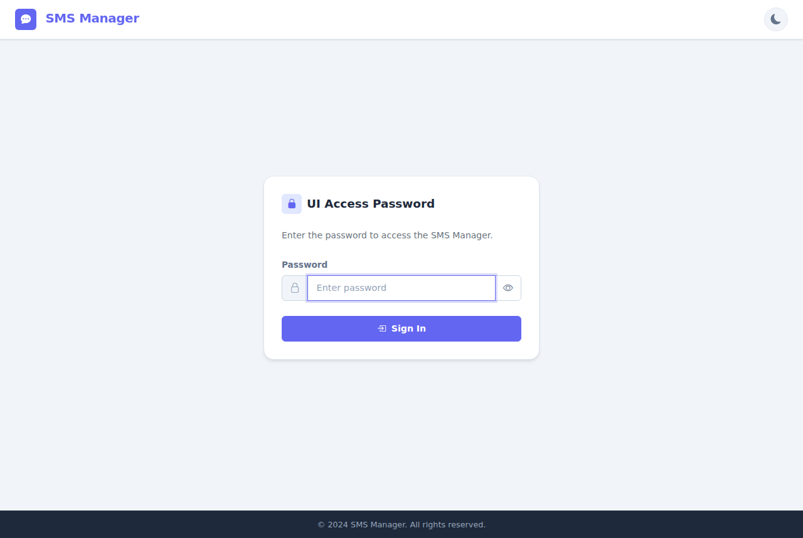
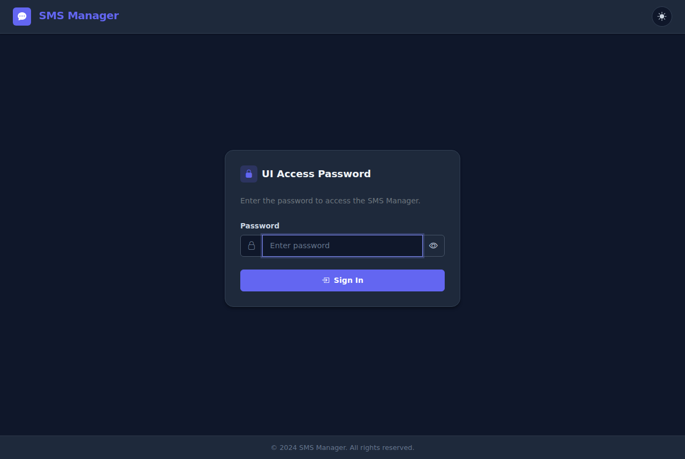

# SMS Frontend Copilot

## Setup Instructions
1. Clone the repository:
   ```bash
   git clone https://github.com/masterlog80/sms-frontend-copilot.git
   cd sms-frontend-copilot
   ```

2. Create the image:
   ```bash
   yes | docker image prune --all
   docker build -t sms-frontend-copilot .
   ```
3. Deploy the composer file:
    ```bash
    docker compose -f docker-compose.yml up -d --remove-orphans
    ```
4. Open [http://localhost:5001](http://localhost:5000) in your browser.

## UI Password Protection

You can optionally protect access to the UI with a password by setting the `PASSWORD_UI` environment variable in the container.

**With Docker Compose**, uncomment and set the variable in `docker-compose.yml`:
```yaml
environment:
  - PASSWORD_UI=your-secret-password
```

**With `docker run`**:
```bash
docker run -d -p 5001:80 -v "$(pwd)/data:/data" -e PASSWORD_UI=your-secret-password sms-frontend-copilot
```

When `PASSWORD_UI` is set, users will be redirected to a login page before they can access the SMS Manager. If `PASSWORD_UI` is **not** set, the UI is accessible without any password.

> **Security note:** This is client-side access control, suitable for preventing casual or accidental access. For sensitive deployments, restrict network access to the container (e.g. via a firewall, VPN, or reverse-proxy with server-side authentication).

## API Debug Logging

You can control the level of API request/response logging in the container logs by setting the `DEBUG_LEVEL` environment variable.

| Value | Description |
|-------|-------------|
| `NO` (default) | No API-specific logging |
| `INFO` | Logs each API call: method, URL, HTTP status code, and response time |
| `DEBUG` | Logs full details including the request body and response status |

**With Docker Compose**, uncomment and set the variable in `docker-compose.yml`:
```yaml
environment:
  - DEBUG_LEVEL=INFO
```

**With `docker run`**:
```bash
docker run -d -p 5001:80 -v "$(pwd)/data:/data" -e DEBUG_LEVEL=DEBUG sms-frontend-copilot
```

Example container log output at `INFO` level:
```
[entrypoint] API info logging enabled (DEBUG_LEVEL=INFO): method, URL, status, timing.
[28/Mar/2025:12:00:00 +0000] API POST /api/rest/mtsms -> status=200 bytes=42 rt=0.312
```

Example container log output at `DEBUG` level:
```
[entrypoint] API debug logging enabled (DEBUG_LEVEL=DEBUG): full request body and response status.
[28/Mar/2025:12:00:00 +0000] API POST /api/rest/mtsms -> status=200 bytes=42 rt=0.312 req_body="{"recipients":[{"msisdn":4512345678}],"message":"Hello","sender":"MyBrand"}"
```

> **Security note:** `DEBUG` level logs the full request body, which may include phone numbers and message content. Use it only in trusted environments and avoid shipping DEBUG-level logs to external log aggregators.

## Usage Guide
1. Open your web browser and navigate to `http://localhost:5001` to see the application running.
2. You can access various features from the navigation bar.
3. Make sure to review the documentation for detailed information on each feature.

If you encounter any issues, please refer to the [issues page](https://github.com/masterlog80/sms-frontend-copilot/issues) for troubleshooting tips and solutions.

## Screenshots

### SMS Manager – Send SMS Tab – Light Mode


### SMS Manager – Send SMS Tab – Dark Mode


### Authentication Page – Light Mode


### Authentication Page – Dark Mode


### Login Page – Light Mode (PASSWORD_UI enabled)


### Login Page – Dark Mode (PASSWORD_UI enabled)


